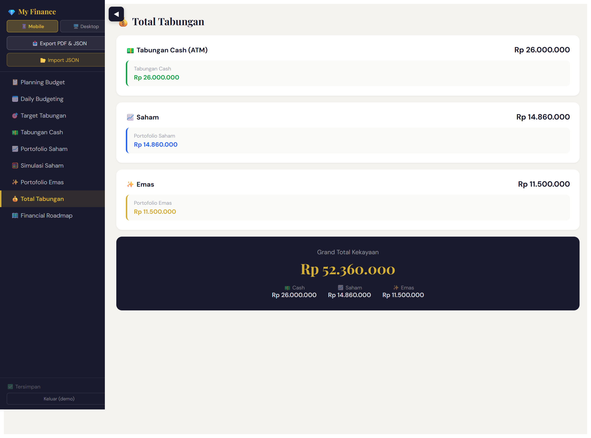
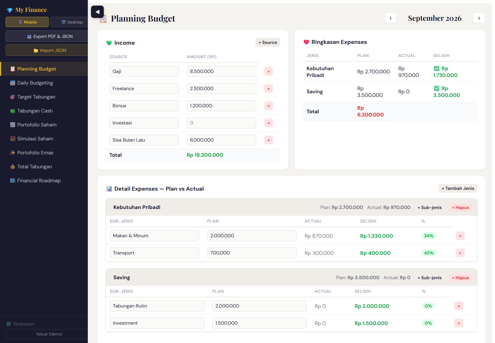
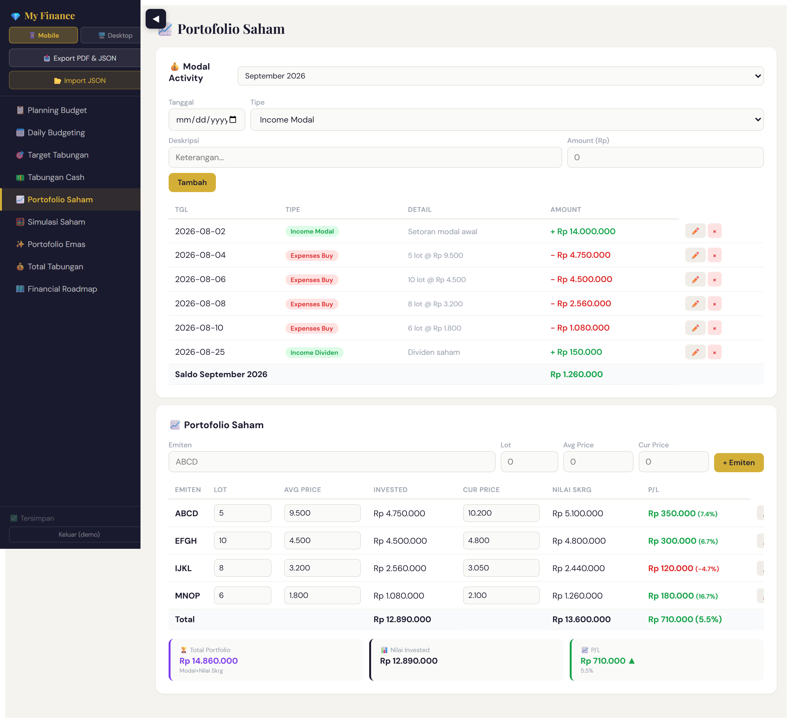
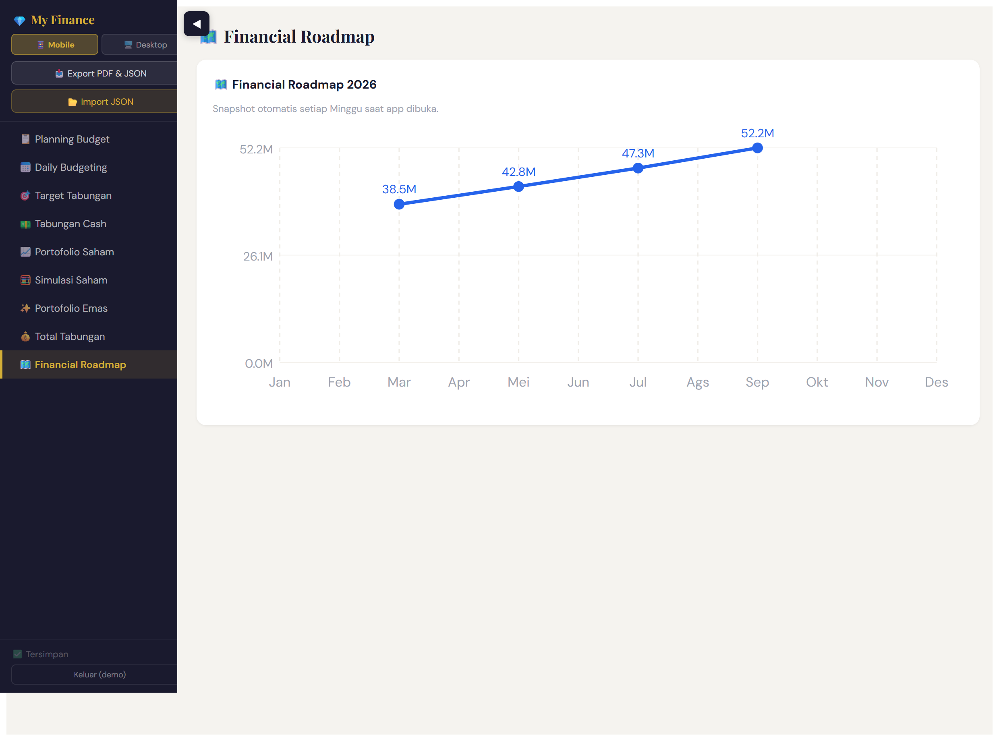

# My Finance — Personal Wealth Dashboard

A single-page app to plan a monthly budget, log daily transactions, and track net
worth across cash, stocks, and gold in one place. Built end to end: data model,
calculation logic, reconciliation, and UI.

> **Public demo.** All balances, transactions, holdings, and figures in this
> repository are **fictional sample data** for demonstration. No real financial
> information is included. The production version runs privately on a separate
> Firebase project with login.



## What it does

- **Budget planning** with plan vs actual per category, where actuals are pulled
  automatically from the daily transaction log.
- **Daily transaction logging** with running balances per bank account and a
  reconciliation check against actual statement balances.
- **Multi-asset net worth**: cash savings, stock portfolios, and gold, rolled up
  into one grand total.
- **Stock portfolio** tracking capital activity (deposits, buys, sells,
  dividends), average price, and unrealized profit/loss per holding.
- **Savings targets** and weekly net-worth snapshots that feed a **roadmap
  chart** of wealth over time.
- **Export** to PDF and JSON, and **import** from JSON.

## Screenshots

| Monthly budget — plan vs actual | Stock portfolio — modal activity & P/L |
|---|---|
|  |  |

Wealth roadmap:



## Tech

- **React 18 + Vite** single-page app.
- Centralized calculation module so every page (net worth, portfolio, roadmap)
  stays consistent (`src/calc.js`).
- **Firebase** Realtime Database + Auth in production (disabled in this demo;
  `src/firebase.js`, `src/auth.jsx`, and `src/storage.js` are swapped for a
  local, no-login build that runs on `localStorage`).

The UI language is Indonesian, matching the tool it was built for.

## Run locally

```bash
npm install
npm run dev
```

On first load the app seeds fictional sample data (`src/demo-data.js`) into
`localStorage`. Clear site data in DevTools to reset.

## Live demo

Deployed via GitHub Pages (GitHub Actions build):
**https://vaniaadisa24.github.io/finance-demo/**

## Data & privacy

The sample data is invented. The production build reads Firebase config from
environment variables so each deployment keeps its data in its own private
project. This public repository contains code and sample data only.

---

Built by Vania Adisaputri · [github.com/Vaniaadisa24](https://github.com/Vaniaadisa24)
